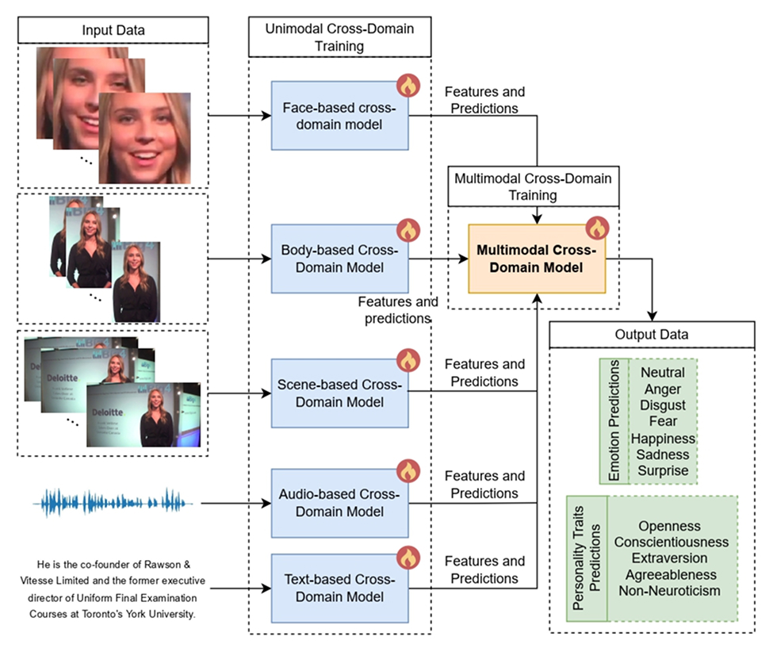
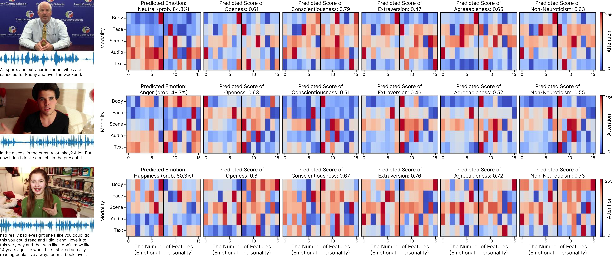
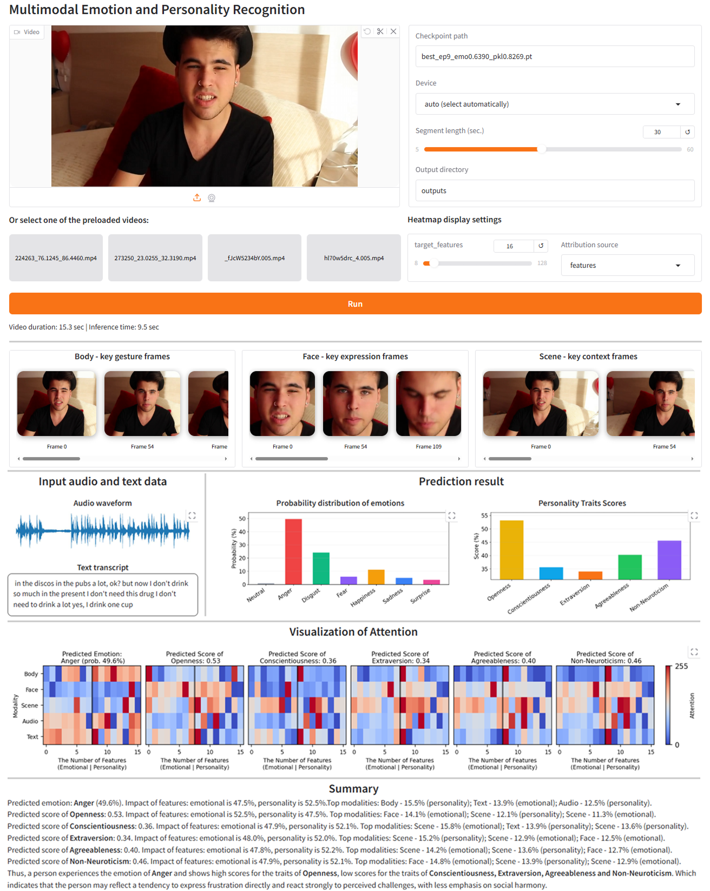

# SSL-MEPR: A Semi-Supervised Multi-Task Cross-Domain Learning Framework for Multimodal Emotion and Personality Recognition

---
> [Elena Ryumina](https://scholar.google.com/citations?user=DOBkQssAAAAJ), [Alexandr Axyonov](https://scholar.google.com/citations?user=Hs95wd4AAAAJ), Darya Koryakovskaya, Timur Abdulkadirov, Angelina Egorova, Sergey Fedchin, Alexander Zaburdaev, [Dmitry Ryumin](https://scholar.google.com/citations?user=LrTIp5IAAAAJ)
>
> LEYA Lab for NLP, HSE University
>
> Speech and Multimodal Interfaces Laboratory, St. Petersburg Federal Research Center of the Russian Academy of Sciences (SPC RAS)

---

## Abstract

The growing demand for personalized human-computer interaction calls for joint modeling of emotion recognition and personality trait assessment. However, large-scale multimodal corpora annotated for both tasks are still lacking. To address this, we propose SSL-MEPR, a Semi-Supervised multi-task cross-domain Learning framework for Multimodal Emotion and Personality Recognition, designed to extract and transfer knowledge across psychological tasks and data domains. SSL-MEPR employs a three-stage learning strategy, combining unimodal single-task, unimodal multi-task, and multimodal multi-task models. We introduce Graph Attention Fusion and Task-Specific Query-based Cross-Attention layers, along with Predict Projectors and Guide Banks, to enhance fusion and integrate heterogeneous semi-labeled data via a modified GradNorm method. Evaluated on MOSEI for emotion recognition and FIv2 for personality recognition, our model achieves 70.26 mean Weighted Accuracy (mWACC) and 92.88 mean Accuracy (mACC) in single-task cross-domain settings, outperforming state-of-the-art results, while multi-task learning yields lower performance (64.26 mWACC, 92.00 mACC), revealing challenges in modality informativeness alignment across domains. Our findings provide evidence of cross-task knowledge: sadness tends to co-occur with lower scores of personality traits, while happiness aligns with higher scores. These findings highlight the complexity of joint modeling and demonstrate how machine learning can enable structured psychological knowledge extraction for robust interaction systems.

---

## Framework Overview

---

## Visualization of model’s attention

---

## User interface of the interactive prototype

---
## Branch Descriptions

| Branch | Description |
|--------|-------------|
| `main` | Default branch containing general repository information and descriptions. Multimodal Cross-Domain Model integrating outputs from all unimodal models, employing Graph Attention Fusion, Task-Specific Query-Based Multi-Head Cross-Attention, Predict Projectors, and Guide Banks.|
| [`app`](https://github.com/LEYA-HSE/SSL-MEPR/tree/app) | Gradio-based interactive prototype for running inference with the SSL-MEPR Multimodal Cross-Domain Model and visualizing predictions, attention heatmaps, keyframes, and personality/emotion scores. |
| [`audio_trainer`](https://github.com/LEYA-HSE/SSL-MEPR/tree/audio_trainer) | Implementation of Audio-based Cross-Domain Model using Wav2Vec2 embeddings and Mamba encoders. |
| [`text_trainer`](https://github.com/LEYA-HSE/SSL-MEPR/tree/text_trainer) | Implementation of Text-based Cross-Domain Model using BGE-en embeddings and Transformer encoders. |
| [`face_trainer`](https://github.com/LEYA-HSE/SSL-MEPR/tree/face_trainer) | Implementation of Face-based Cross-Domain Model using CLIP embeddings and Mamba encoders. |
| [`body_trainer`](https://github.com/LEYA-HSE/SSL-MEPR/tree/body_trainer) | Implementation of Body-based Cross-Domain Model using CLIP embeddings and Mamba encoders. |
| [`scene_trainer`](https://github.com/LEYA-HSE/SSL-MEPR/tree/scene_trainer) | Implementation of Scene-based Cross-Domain Model using CLIP embeddings and Transformer encoders. |
---

## Training Procedure

Training consists of **three stages**, clearly separated in the repository:

### 1. **Unimodal Single-Domain Training**
Independent training of modality-specific single-domain models (Stage 1)

### 2. **Unimodal Cross-Domain Training**
Cross-domain adaptation of unimodal models. Each model leverages features and predictions from single-domain training, refined via cross-attention fusion between emotion and personality tasks. (Implemented within each respective modality trainer.)

### 3. **Multimodal Cross-Domain Training**
Integration of unimodal cross-domain features and predictions into the Multimodal Cross-Domain Model, with the following key components:

- **Graph Attention Fusion:** integrates multimodal features by modeling inter-modality relationships.
- **Task-Specific Query-Based Multi-Head Cross-Attention Fusion:** selectively attends to modality-specific embeddings, optimized separately for emotion and personality recognition.
- **Predict Projectors:** task-specific projection layers combining unimodal predictions.
- **Guide Banks:** sets of learned embeddings providing semantic alignment across modalities.
- **Joint Multitask Training:** simultaneously optimizing for emotion classification and personality trait regression.

---
