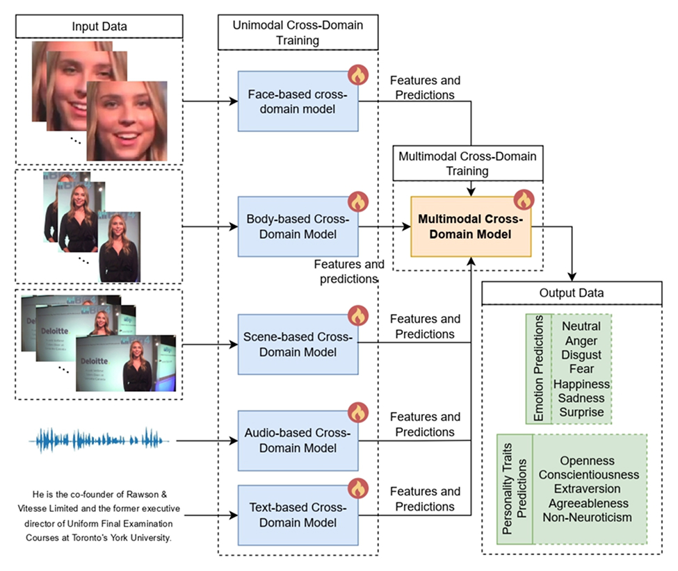

# SSL-MEPR: A Semi-Supervised Multi-Task Cross-Domain Learning Framework for Multimodal Emotion and Personality Recognition

This repository accompanies the publication in **Expert Systems with Applications (ESWA), 2025**:

> [Elena Ryumina](https://scholar.google.com/citations?user=DOBkQssAAAAJ), [Alexandr Axyonov](https://scholar.google.com/citations?user=Hs95wd4AAAAJ), Darya Koryakovskaya, Timur Abdulkadirov, Angelina Egorova, Sergey Fedchin, Alexander Zaburdaev, [Dmitry Ryumin](https://scholar.google.com/citations?user=LrTIp5IAAAAJ)
>
> HSE University

---

## 🧠 Abstract

The growing demand for intelligent human-computer interaction systems has driven the need for personalized solutions. Early research addressed this issue through Emotion Recognition (ER) methods, while current approaches focus on assessing individual Personality Traits (PTs). However, effective systems must integrate both capabilities, requiring large-scale corpora annotated for both tasks, which are currently unavailable.

We introduce a semi-supervised multi-task cross-domain learning framework for Multimodal Emotion and Personality Recognition (MEPR) with a three-stage learning strategy, combining unimodal single- task single-domain, unimodal multi-task cross-domain, and multimodal multi-task cross-domain models. We further enhance multimodal fusion by proposing Graph Attention Fusion and Task-Specific Query-Based Multi-Head Cross-Attention Fusion layers, as well as task-specific Predict Projectors and Guide Banks. These improvements and modifications to the Gradnorm method enable the model to effectively integrate heterogeneous and semi-labeled data. The framework is evaluated on two large-scale corpora, CMU Multimodal Opinion Sentiment and Emotion Intensity (MOSEI) for ER and ChaLearn First Impressions v2 (FIv2) for Personality Traits (PTs) assessment, showcasing its potential application in personalized human-computer interaction systems.

In single-task cross-domain learning, our model achieves mean Average Weighted Accuracy (mWACC) of 70.26 on MOSEI and mean Accuracy (mACC) of 92.88 on FIv2, outperforming state-of-the-art results. In contrast, multi-task cross-domain learning demonstrates reduced performance, yielding mWACC of 64.26 on MOSEI and mACC of 92.00 on FIv2. Our results highlight the complexity of both single-task single- or cross-domain learning (the problem of overfitting on single-domain) and multi-task cross-domain learning (the problem of adapting a model to different domains varying modality informativeness). We also study the
relationship between these phenomena, finding that negative emotions, especially Sadness, are negatively correlated with high-level PTs scores, whereas Happiness is positively associated with these levels.

---

## ✨ Highlights

- A novel unified semi-supervised multi-task cross-domain learning framework for Multimodal Emotion and Personality Recognition, called SSL-MEPR.
- A multimodal fusion mechanism with Graph Attention and Task-Specific Query-Based Multi-Head Cross-Attention.
- A three-stage learning strategy designed to enhance intra- and inter-domain interactions across modalities.
- Establishment of new baselines on two benchmarks: CMU-MOSEI and ChaLearn First Impressions v2.
- The framework is designed for personalized human-computer interaction systems.

---

## 🧭 Framework Overview

<em> Figure: Pipeline of semi-supervised multi-task cross-domain learning framework for MEPR.</em>

---

## 🌳 Branch Descriptions

| Branch | Description |
|--------|-------------|
| `main` | Default branch containing general repository information and descriptions corresponding to the ESWA 2025 publication. Multimodal Cross-Domain Model integrating outputs from all unimodal models, employing Graph Attention Fusion, Task-Specific Query-Based Multi-Head Cross-Attention, Predict Projectors, and Guide Banks.|
| `audio_trainer` | Implementation of Audio-based Cross-Domain Model using Wav2Vec2 embeddings and Mamba encoders. |
| `text_trainer` | Implementation of Text-based Cross-Domain Model using BGE-en embeddings and Transformer encoders. |
| `face_trainer` | Implementation of Face-based Cross-Domain Model using CLIP embeddings and Mamba encoders. |
| `body_trainer` | Implementation of Body-based Cross-Domain Model using CLIP embeddings and Mamba encoders. |
| `scene_trainer` | Implementation of Scene-based Cross-Domain Model using CLIP embeddings and Transformer encoders. |

---

## 🏋️‍♂️ Training Procedure

Training consists of **three stages**, clearly separated in the repository:

### 1. **Unimodal Single-Domain Training**
Independent training of modality-specific single-domain models (Stage 1):

- [`audio_trainer`](https://github.com/LEYA-HSE/SSL-MEPR/tree/audio_trainer)
- [`text_trainer`](https://github.com/LEYA-HSE/SSL-MEPR/tree/text_trainer)
- [`face_trainer`](https://github.com/LEYA-HSE/SSL-MEPR/tree/face_trainer)
- [`body_trainer`](https://github.com/LEYA-HSE/SSL-MEPR/tree/body_trainer)
- [`scene_trainer`](https://github.com/LEYA-HSE/SSL-MEPR/tree/scene_trainer)

### 2. **Unimodal Cross-Domain Training**
Cross-domain adaptation of unimodal models. Each model leverages features and predictions from single-domain training, refined via cross-attention fusion between emotion and personality tasks. (Implemented within each respective modality trainer.)

### 3. **Multimodal Cross-Domain Training**
Integration of unimodal cross-domain features and predictions into the Multimodal Cross-Domain Model, with the following key components:

- **Graph Attention Fusion:** integrates multimodal features by modeling inter-modality relationships.
- **Task-Specific Query-Based Multi-Head Cross-Attention Fusion:** selectively attends to modality-specific embeddings, optimized separately for emotion and personality recognition.
- **Predict Projectors:** task-specific projection layers combining unimodal predictions.
- **Guide Banks:** sets of learned embeddings providing semantic alignment across modalities.
- **Joint Multitask Training:** simultaneously optimizing for emotion classification and personality trait regression.

---
